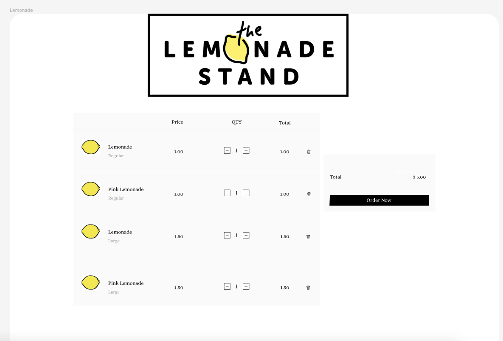
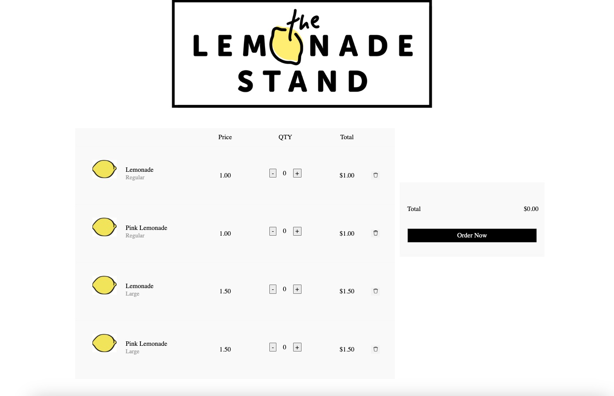

# Lemonade Stand

Simple retail app. Please see below. Full stack application using the below technologies:  
* React.js: v18.2.0  
* .NET: 7.0  
* Entity Framework Core (EF Core): v7.0  
* PostgreSQL  

---

## **User Stories**
* As a user, I can add varying quantities of products to my cart.  
* As a user, I can clear my order of each product with a single action.  
* As a user, I can see the total cost of my cart updated instantly as I add or adjust items.  
* As a user, I can submit my order, enter my customer data, and receive a confirmation number.  

---

## **UI Requirements**
In addition to the below specifications, it was also requested that I reproduce a provided UI mock-up.  

_mock-up_  
  

_final result with data populated_  
  

---

## **Specs**
### **Acceptance criteria provided:**
1. Allow you to modify lemonade types and sizes in the datastore and automatically update types and sizes displayed to the customer.  
2. Allow customers to initially buy 2 types of lemonade:  
   a. Regular lemonade  
   b. Pink lemonade  
3. Allow customers to initially buy 2 sizes of lemonade:  
   a. Regular size  
   b. Large size  
4. Allow customers to enter their personal information to pick up their orders:  
   a. Name  
   b. Phone number or email  
5. Display an order number for customers.  
6. Record orders in a datastore to keep track of orders.  
7. Store codebases in a public git repository.  

---

## **Detailed File Explanations**

### **Frontend**
- **`Wrapper.jsx`**  
  Handles state management using the `useReducer` hook. The component fetches initial product data from the backend API and initializes global state via `OrderContext`. It dispatches actions for adding items, resetting the order, and submitting the order.

- **`OrderForm.jsx`**  
  Displays input fields for customer details and allows the user to submit their order. This component interacts with the global state to track the items added to the cart.

- **`TotalBox.jsx`**  
  Dynamically calculates and displays the total price of the order based on the items in the cart. Updates are instantaneous as items are added or removed.

- **`AlertModal.jsx`**  
  A reusable component that shows confirmation messages or alerts. The modal closes when users click outside its bounds, providing a clean user experience.

- **`ListRow.jsx`**  
  Displays a single row in the product list, showing details such as the flavor, size, and price of a product. Users can adjust quantities for individual items.

- **`QuantityComponent.jsx`**  
  Provides a simple and intuitive interface for users to increase or decrease the quantity of an item in their cart.

---

### **Backend**
- **`OrdersController.cs`**  
  Handles customer orders.  
  - **POST /api/Orders**: Accepts a JSON payload with customer and order details. Maps this data into the database and generates an order confirmation number.  
  - **GET /api/Orders/{id}**: Retrieves a specific order by its ID.

- **`ProductsController.cs`**  
  Serves product data to the frontend.  
  - **GET /api/Products**: Returns all available products, sorted by size and flavor.

- **Models**  
  Represent the database structure, including relationships between entities like:  
  - **`Customer`**: Stores customer information.  
  - **`Order`**: Represents an order and its associated items.  
  - **`OrderItem`**: Represents individual items within an order.  
  - **`Product`**: Stores product information, including flavor, size, and price.

- **DTOs**  
  Simplify and secure data transfer between the frontend and backend by exposing only necessary properties.

- **MappingProfile.cs**  
  Configures mappings between DTOs and models using AutoMapper, ensuring seamless data transformations.

- **LemonadeContext.cs**  
  Configures Entity Framework Core to interact with the PostgreSQL database.

---

## **ERD**

---

## **Design Decisions**
Given more time, I would refactor the order form to live outside the `TotalBox` component and instead use a popup modal for improved aesthetics. I’ve created a simple modal component for my alerts here, but would prefer to incorporate a library like Bootstrap to handle modals easily and allow users to receive alerts without having to click out of them. Using DTOs for a simple application is something I would try to avoid, but they facilitate scalability and easy adaptation should any of the APIs need to be changed.

---

## **Supporting Tools**
- **Postman:** Used to test API calls during development.  
- **Chrome React Developer Tools:** Used to see state changes during application flow and debugging.  
- **PostgreSQL Explorer for VS Code:** Used to query my database.  
- **LucidChart:** Used to create my ERD diagram.

---

## **Next Steps**
- Implement responsive UI design utilizing CSS media queries to automatically adjust the size of components for different screen sizes, including mobile.  
- End-to-end testing using Jest and NUnit.  
- Improved front-end validation to verify phone and email formats.  
- Authorization and customer lookup for repeat orders.  
- Suggest reordering a recent order or allow saving a favorite order for repeat customers.
